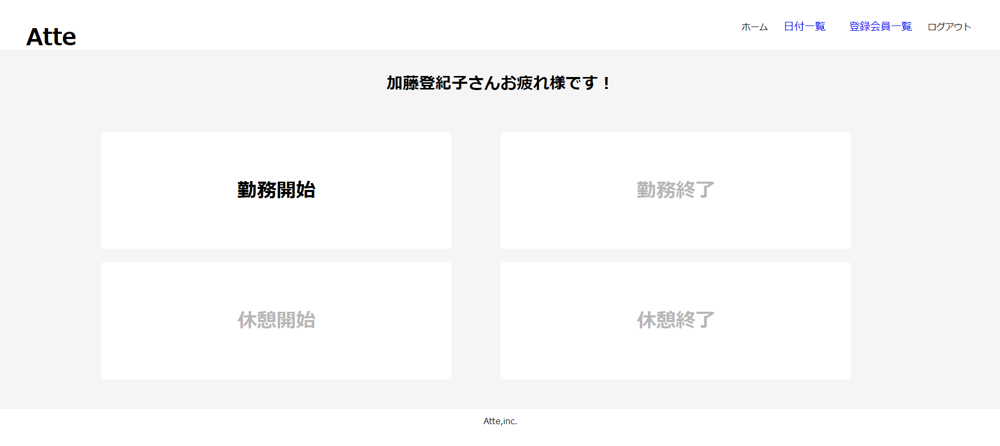

#アプリケーション名　Atte
概要説明：勤怠管理アプリです。


##　作成した目的
人事評価に使用するのに個人の勤怠状況を把握するため。

##　アプリケーションのURL

会員登録時に、登録したメールアドレス宛に本人確認のためのリンク付きメールが送られてくるので、
リンクボタンをクリック、または添付されているURLをブラウザに貼り付け直接検索することにより認証が完了しログイン可能になります。
送られてきたメールでの認証を行わないとログインすることができません。

##　機能一覧
-会員登録機能
-ログイン機能
-ログアウト機能
上記3点はLaravelの認証機能を利用
-勤務開始（日をまたいだ時点で翌日の出勤操作に切り替える）
-勤務終了
-休憩開始（１日に何度も休憩可能）
-休憩終了
-日付別勤怠情報取得
-名前・メールアドレスによる部分一致検索機能
-登録会員情報取得
-会員ごとの勤怠情報取得
-ページネーション（5件ずつ取得）

## 使用技術
Laravel Framework 8.83.27
PHP 8.3.6
nginx 1.21.1
mysql 8.0.26
myadmin 5.2.1
mailhog

## テーブル設計


## ER図


# 環境構築
1.リポジトリの設定
開発環境をGitHubからクローン。
クローンを作りたいディレクトリ下で以下のコマンドを実行。
`$ git clone git@github.com:coachtech-material/laravel-docker-template.git`

リポジトリ名の変更。
`$ mv laravel-docker-template 新しいリポジトリ名`

2.個人のリモートリポジトリURLを変更
GitHubで、上記コマンドで指定した「新しいリポジトリ名」で変更先のリモートリポジトリをpublicで作成。
ローカルリポジトリから紐づけ先を変更するために、GitHubで新しいリポジトリ名で作成したリポジトリのURLを取得する。
URLはQuik setup～内の四角が二つ重なったアイコンから取得する。
(https://coachtech-lms-bucket.s3.ap-northeast-1.amazonaws.com/curriculum/07_part/01_chapter/img/remote-url.png)
下記コマンドの実行。
```
$ cd contact-form
$ git remote set-url origin 作成したリポジトリのURL
$ git remote -v
```
３つ目のコマンドを実行した時に変更先のURLが表示されれば成功。

3.現在のローカルリポジトリのデータをリモートリポジトリに反映させる
下記コマンドの実行。
```
$ git add .
$ git commit -m "リモートリポジトリの変更"
$ git push origin main
```
GitHubのページを見てdockerフォルダやsrcフォルダが反映されていれば成功。
エラーが発生する場合は
`$ sudo chmod -R 777 *`
コマンドを実行後、もう一度コマンドを実行し直してみる。

4.Dockerの設定
下記コマンドの実行。
```
$ docker-compose up -d --build`
$ code .
```
Dockerにコンテナができているか確認。

5.laravelのパッケージのインストール
共有元が作成したcomposer.jsonファイルやcomposer.lockファイルを元に必要なパッケージをインストールする。
PHPコンテナ内にログインする。
`$ docker-compose exec php bash`
下記コマンドでcomposer.jsonに記載されたパッケージのリストをインストール。
`$ composer install`

6.「.envファイル」の作成
データベースに接続するために .envファイルを作成。PHPコンテナ内で以下のコマンドを実行。
```
$ cp .env.example .env
$ exit
```
作成できたらVSCodeから .envファイルの11行目以降を以下のように修正。
```
// 前略

DB_CONNECTION=mysql
- DB_HOST=127.0.0.1
+ DB_HOST=mysql
DB_PORT=3306
- DB_DATABASE=laravel
- DB_USERNAME=root
- DB_PASSWORD=
+ DB_DATABASE=laravel_db
+ DB_USERNAME=laravel_user
+ DB_PASSWORD=laravel_pass

// 後略
```
上記はdocker-compose.ymlで作成したデータベース名、ユーザー名、パスワードを記述している。
（mysqlのenvironent部分）
docker-compose.ymlで設定したphpmyadminにデータベース（laravel_db）が存在しているか確認ができたら完了。
http://localhost:8080/　で確認。
